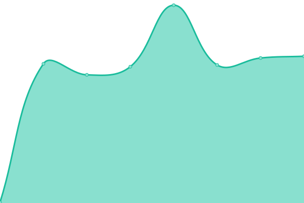

# [📈 Live Status](https://constructions-incongrues.github.io/institut-status): <!--live status--> **🟧 Partial outage**

This repository contains the open-source uptime monitor and status page for [Constructions Incongrues](https://constructions-incongrues.net), powered by [Upptime](https://github.com/upptime/upptime).

With [Upptime](https://upptime.js.org), you can get your own unlimited and free uptime monitor and status page, powered entirely by a GitHub repository. We use [Issues](https://github.com/constructions-incongrues/institut-status/issues) as incident reports, [Actions](https://github.com/constructions-incongrues/institut-status/actions) as uptime monitors, and [Pages](https://constructions-incongrues.github.io/institut-status) for the status page.

<!--start: status pages-->
<!-- This summary is generated by Upptime (https://github.com/upptime/upptime) -->
<!-- Do not edit this manually, your changes will be overwritten -->
<!-- prettier-ignore -->
| URL | Status | History | Response Time | Uptime |
| --- | ------ | ------- | ------------- | ------ |
|  [Institut](https://institut.incongru.org) | 🟩 Up | [institut.yml](https://github.com/constructions-incongrues/institut-status/commits/HEAD/history/institut.yml) | 

 259ms
     
 | 

<a href="https://constructions-incongrues.github.io/institut-status/history/institut">100.00%</a>
    

|  [Ivresse](https://data.constructions-incongrues.net/musiques-incongrues/) | 🟥 Down | [ivresse.yml](https://github.com/constructions-incongrues/institut-status/commits/HEAD/history/ivresse.yml) | 

 167ms
     
 | 

<a href="https://constructions-incongrues.github.io/institut-status/history/ivresse">0.00%</a>
    

|  [Tentacules](https://tentacules.interzone.network) | 🟥 Down | [tentacules.yml](https://github.com/constructions-incongrues/institut-status/commits/HEAD/history/tentacules.yml) | 

 0ms
     
 | 

<a href="https://constructions-incongrues.github.io/institut-status/history/tentacules">0.00%</a>
    

|  [Yazoo!](https://yazoo.constructions-incongrues.net/health) | 🟥 Down | [yazoo.yml](https://github.com/constructions-incongrues/institut-status/commits/HEAD/history/yazoo.yml) | 

 242ms
     
 | 

<a href="https://constructions-incongrues.github.io/institut-status/history/yazoo">0.00%</a>
    

<!--end: status pages-->

[**Visit our status website →**](https://constructions-incongrues.github.io/institut-status)

## 📄 License

- Powered by: [Upptime](https://github.com/upptime/upptime)
- Code: [MIT](./LICENSE) © [Constructions Incongrues](https://constructions-incongrues.net)
- Data in the `./history` directory: [Open Database License](https://opendatacommons.org/licenses/odbl/1-0/)
